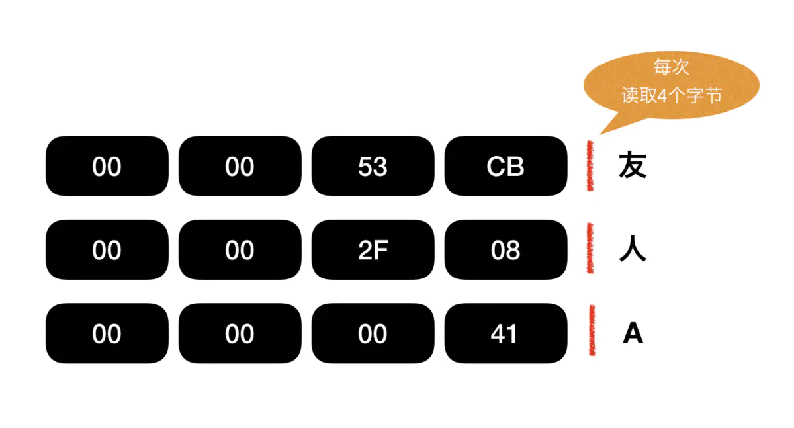
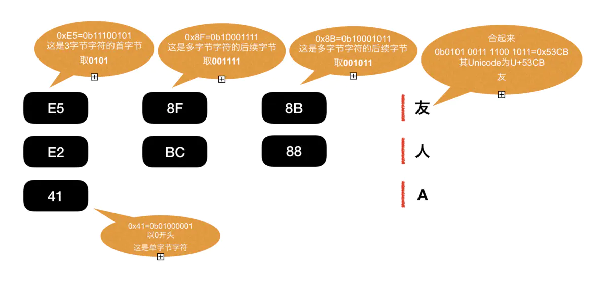
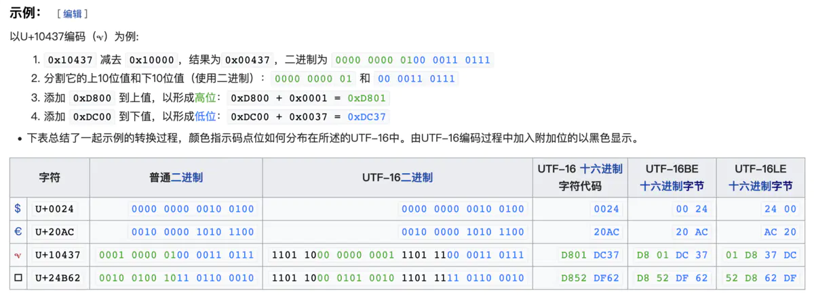
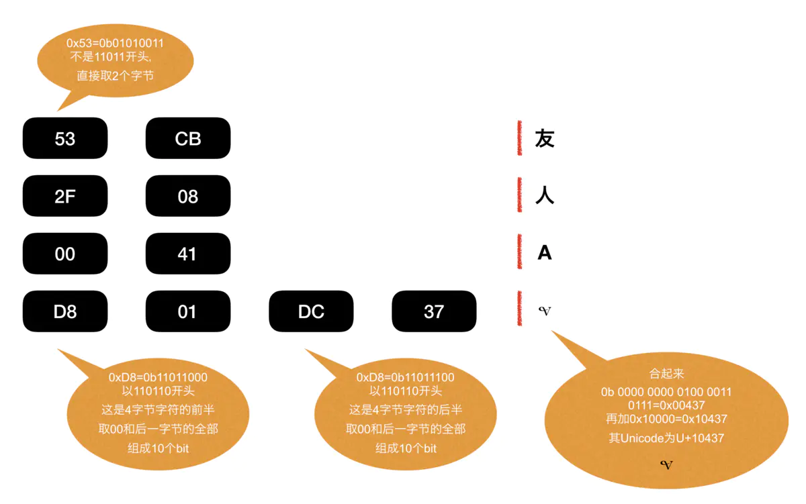

## UTF是什么的简写

UTF是 **Unicode\* Transformation Format** 的简写。直译就是Unicode的转换格式。
（\* U同时也是UCS的简写，UCS和Unicode是两个组织订立的标准，但是码表基本兼容，在此略过不提）
UTF-8, UTF16, UTF-32分别对应8bit, 16bit, 32bit长度的转换格式。在下文详细描述。

## 什么是Unicode

对计算机而言，什么汉字偏旁部首，英文字母，日语假名那都是不存在的。大千世界的纷繁复杂到了计算机里最终都化成了0和1组成的二进制数。
那怎么让计算机看懂人类用的字符呢？很简单，把字符都定义成二进制数就行了，一个字符一个数，一个萝卜一个坑，简单易懂。

### ASCII

计算机发展早期大多采用ASCII编码。其使用一个字节，即8位二进制数来表示字符。
ASCII的起始位为0，可以表示27即128个字符。这些字符包含了0-9的数字，各种常用符号，大小写英文字母以及一些控制符等。
如字符`a`对应的ASCII编码为`0b01100001`或者`0x61`
**（\* `0b`代表二进制，`0x`代表十六进制，下同）**
或者以我们常用的十进制为编号`97`。

*ASCII起源于电报时代，27即128个字符已足以满足当时需求。直到1970年代8位处理器开始普及，字节（Byte）的单位也由4位，6位等统一为8位二进制数（8bit）并沿用至今。ASCII在8位二进制数中首位置0。后来也发展出extended ASCII编码，对首位为1的编码定义，充分利用了一个字节256个编码。但即便如此256个编码也不可能满足全世界对字符编码的需求。*

随着计算机技术的高速发展与普及，各地都发展出了各自的编码标准，以满足在计算机上显示，处理本国语言的需求。然而一时之间标准频出，彼此之间又多不兼容，导致乱码丛生，一发不可收拾。

### Unicode

这时对一个全球通用的字符编码标准的需求越来越高，而Unicode就是为此而诞生。
Unicode的解释可以参照wikipedia。以下摘自[wiki-Unicode词条](https://zh.wikipedia.org/wiki/Unicode)
>**Unicode**（中文：万国码、国际码、统一码、单一码）是[计算机科学](https://zh.wikipedia.org/wiki/%E9%9B%BB%E8%85%A6%E7%A7%91%E5%AD%B8 "计算机科学")领域里的一项业界标准。它对世界上大部分的[文字系统](https://zh.wikipedia.org/wiki/%E6%96%87%E5%AD%97%E7%B3%BB%E7%B5%B1 "文字系统")进行了整理、编码，使得电脑可以用更为简单的方式来呈现和处理文字。
Unicode 伴随着[通用字符集](https://zh.wikipedia.org/wiki/%E9%80%9A%E7%94%A8%E5%AD%97%E7%AC%A6%E9%9B%86 "通用字符集")的标准而发展，同时也以书本的形式[[1]](https://zh.wikipedia.org/wiki/Unicode#cite_note-1)对外发表。Unicode 至今仍在不断增修，每个新版本都加入更多新的字符。当前最新的版本为2019年5月公布的12.1.0[[2]](https://zh.wikipedia.org/wiki/Unicode#cite_note-Unicode12.0-2)，已经收录超过13万个[字符](https://zh.wikipedia.org/wiki/%E5%AD%97%E7%AC%A6 "字符")（第十万个字符在2005年获采纳）。Unicode涵盖的数据除了视觉上的字形、编码方法、标准的[字符编码](https://zh.wikipedia.org/wiki/%E5%AD%97%E7%AC%A6%E7%BC%96%E7%A0%81 "字符编码")外，还包含了字符特性，如大小写字母。

简单说来Unicode就是一个包含世界上大多数国家的文字/符号的编码标准。它给每个字符一个编号，形成了一个庞大的字符集。

### Unicode的表示

Unicode拓展自ASCII，因此上文的`a`在Unicode中的编码不变，为`U+0061`。
Unicode编码为`U+`加上至少4位十六进制数字的形式表示。例如`我`这个汉字的Unicode为`U+6211`，`汉`的Unicode为`U+6c49`。最新的Unicode12.1版本中除去tag，被注册的最大的编码为中日韩兼容表意文字，为`U+2F9FF`。
[https://unicode-table.com/cn/#2F9FF](https://unicode-table.com/cn/#2F9FF)

## Unicode Transformation Format (UTF)

如上文所述，一个字节8位，至多表示28=256个编码。而Unicode以收录十多万个字符，显然用一个字节无法表示所有的Unicode编码。
两个字节16位，至多表示216=65536个编码。显然也不足够。
再翻个倍四个字节32位，就能表示232=4294967296个编码。所以Unicode通常使用1-4个字节来表示字符。
计算机很蠢，看到一大堆数据便直接一整套全都读取进去。如何分割字节，如何把编码转化成字符，必须由人来告诉它。
UTF即是告诉计算机如何存储读取字符的一种格式。

### UTF-32

上文提到，4个字节足以表示任何Unicode，因此UTF-32就采用每个字符4个字节的储存形式（4个字节为32位，因此是UTF-32）。
UTF-32格式下，每个字符会读取4个字节，然后按标准转化为字符。

- 这种格式的好处在于，读取效率尤其高。计算机只管4个字节4个字节地读，不需要考虑其他。
- 而缺点就在于，空间占用率过大。
对于英语国家而言，常用的字符已包含在ASCII中，也就是说一个字节就能满足大多数使用场景。而UTF-32的格式下，即便是ASCII中的字符，也要占用4个字节，是原来的4倍。
*（4倍，那是什么概念！！四舍五入就是一个亿啊！！）*

考虑到UTF-32造成的浪费，一般情况下UTF-8和UTF-16才是主流选择。

### UTF-8

UTF-8是最常用的一种Unicode转换格式。也是最灵活的一种格式。
UTF-8解决了UTF-32占用空间过大的问题。8即是8位，代表着读取单位为8bit，即1个字节。
ASCII的字符只用这1个字节便可以转换，而其他字符则由多个字节组成。
由于采用了这种组合式的做法。UTF-8编码的每个字节需要用字节开头的几位（bit）来告诉计算机一些信息，比如这个字节是某个字符的首字节，由多少个字节组成，亦或者这个字节是别的字符的后续。
其具体规则如下，参考自https://stackoverflow.com/a/33349765  
  
|Binary|Hex|Comments|
|---|---|---|
|0xxxxxxx|0x00..0x7F|Only byte of a 1-byte character encoding **单字节字符**|
|10xxxxxx|0x80..0xBF|Continuation byte: one of 1-3 bytes following the first **多字节字符的后续字节**|
|110xxxxx|0xC0..0xDF|First byte of a 2-byte character encoding **双字节字符的首字节**|
|1110xxxx|0xE0..0xEF|First byte of a 3-byte character encoding **三字节字符的首字节**|
|11110xxx|0xF0..0xF7|First byte of a 4-byte character encoding **四字节字符的首字节**|

- 单字节字符首位取`0`
- n字节字符的首字节前n位取`1`，n+1位取`0`
- 多字节字符的后续字节前两位取`10`

UTF-8解决了常用字符（1-3字节）在UTF-32下占用空间过大的问题。但其缺点也同样存在，
- 其一，相对于UTF-32，UTF-8的读取效率有所降低，毕竟需要读取标识位并加以转化。
相比直接读取4个字节，会消耗一小部分性能。
- 其二，Unicode中汉字区间为[0x4E00→0x9FA5](http://blog.csdn.net/m372897500/article/details/37592543)，在UTF-8下都需要占用三个字节，如上图`友`字，UTF-8下编码为`E58F8B`，但其Unicode编码其实是`U+53CB`，理论上只使用两个字节就能表示，也存在着空间浪费的情况。
*美国人是开心了，中国人民不干了*

### UTF-16

UTF-16是一种折衷的方案，UTF-16使用2或者4个字节来表示字符。
`U+0000`-`U+FFFF`的字符均用2个字节表示，而此范围以外的字符用4个字节表示。
由于常用字符以及主要国家的文字字符基本都包含在这个范围中，所以在绝大多数情况下字符都只需2个字节，通用性很高。
*世界人民皆大欢喜*

UTF-16可以表示`U+0000`-`U+10FFFF`的编码区间，有一千多万个编码，在现阶段足够使用。
其编码规则如下
1. `U+0000` - `U+FFFF`
使用两个字节直接表示。
2. `U+10000` - `U+10FFFF`
  a. 将Unicode编码减去`0x10000`（因为`0x10000`以下的编码已包含在1中），得到的编码的区间是`0x00000`-`0xFFFFF`（最大为5位16进制数，即20位二进制数，20bit）。
  b. 将得到的编码分为两部分，每一部分为10位二进制数（10bit）。
  c. 在高位的10bit前补上6位的标识`110110`，即加上`0b 1101 1000 0000 0000`=`0xD800`，这个`0xD800`也称为**前导代理**（lead surrogates）。
  d. 在低位的10bit前补上6位的标识`110111`，即加上`0xDC00`，这个`0xDC00`也称为**后尾代理**（trail surrogates）。

可参照[wiki的示例](https://zh.wikipedia.org/wiki/UTF-16)

而读取时的转化方法如下图所示

UTF-16作为一个折衷方案，使常用字符都能用2个字节表示，这是其最大的优点。
**而由于UTF-16使用了前导/后导代理，导致以`11011`开头的Unicode编码无法使用（会导致UTF-16格式下无法辨识），因此Unicode规定`U+D800` - `U+DFFF`区间内的编码空置。**

### BOM（字节顺序标记）

由于多种字符转化格式的存在，一个文本文件通常需要在其开头注明该文件的格式。
这种文件开始处的标记就称为byte-order mark，BOM。
BOM的示例直接从wiki拉过来
[https://en.wikipedia.org/wiki/Byte_order_mark](https://en.wikipedia.org/wiki/Byte_order_mark)

| 编码 | 表示（[十六进制](https://zh.wikipedia.org/wiki/%E5%8D%81%E5%85%AD%E9%80%B2%E4%BD%8D "十六进制")） | 表示（[十进制](https://zh.wikipedia.org/wiki/%E5%8D%81%E9%80%B2%E4%BD%8D "十进制")） |
| --- | --- | --- |
| UTF-8 | `EF BB BF` | `239 187 191` |
| UTF-16（大端序） | `FE FF` | `254 255` |
| UTF-16（小端序） | `FF FE` | `255 254` |
| UTF-32（大端序） | `00 00 FE FF` | `0 0 254 255` |
| UTF-32（小端序） | `FF FE 00 00` | `255 254 0 0` |
| UTF-7 | `2B 2F 76` 和以下的*一个*字节： `[ 38 \| 39 \| 2B \| 2F ]` | `43 47 118` 和以下的*一个*字节： `[ 56 \| 57 \| 43 \| 47 \]` |
| UTF-1 | `F7 64 4C` | `247 100 76` |
| UTF-EBCDIC | `DD 73 66 73` | `221 115 102 115` |
| Unicode标准压缩方案 | `0E FE FF` | `14 254 255` |
| BOCU-1 | `FB EE 28` *及可能跟随着*`FF` | `251 238 40` *及可能跟随着*`255` |
| GB-18030 | `84 31 95 33` | `132 49 149 51` |

---
  
  
以上为一个半路出家的码农，遍搜学习资料后加以自己的理解，整理成文
